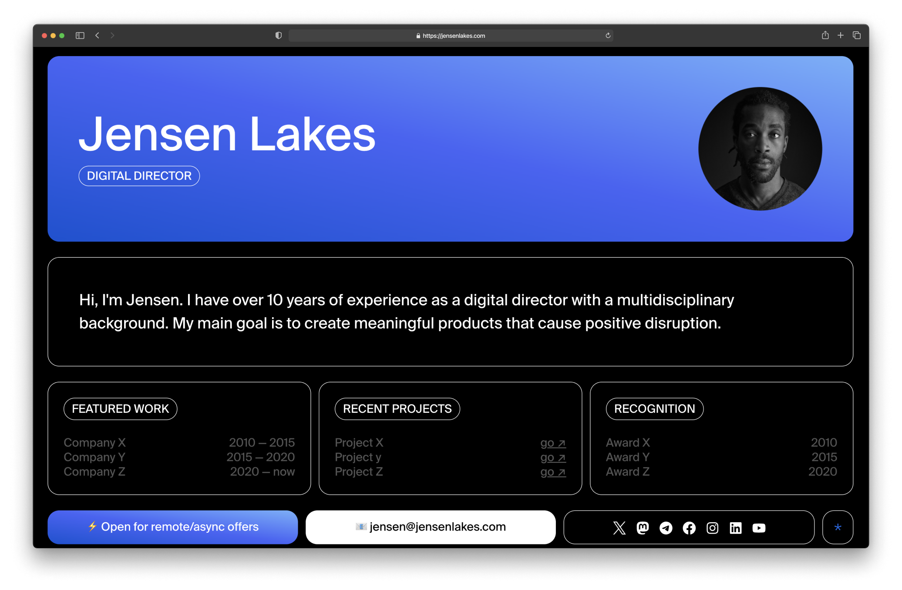

# The «Solo» Template

Hey! Thank you for your interest in my work. Feel free to experiment with this template and to make it your own. 

This template is created with [Astro](https://astro.build/) and [Tailwind](https://tailwindcss.com/).



## Structure
You'll find the following folders and files structure inside your project. 

```text
├── public/
│   └── favicon.svg
    └── SuisseIntl-Book.otf
├── src/
│   ├── components/
│   │   └── About.astro
│   │   └── Card.astro
│   │   └── CardContent.astro
│   │   └── Footer.astro
│   │   └── Header.astro
│   │   └── InfoGrid.astro
│   ├── layouts/
│   │   └── Layout.astro
│   ├── pages/
│   │   └── index.astro
│   └── info.js
└── package.json
```

## Customize

All the data displayed on the page exists in one single file — `info.js` (`src/info.js`). Here you can add your own info such as name, email, and much more. 

You might want to update the photo. In order to do so, make sure to place the new picture inside the `scr/assets/` folder. Don't forget to double-check your file name and update it inside the `info.js` as well.

This template is designed to be a single-screen website. Yet you still can add more sections, and customize it further if needed.

## Plugins
Currently, this project contains several plugins:
- [Astro + Tailwind](https://docs.astro.build/en/guides/integrations-guide/tailwind/);
- [Astro Compress](https://github.com/astro-community/AstroCompress#readme);
- [Astro Robots](https://github.com/alextim/astro-lib/tree/main/packages/astro-robots-txt#readme);

## Help
If you need any help with customization, design or anything, feel free to [reach out](mailto:shapeshifter@skiff.com)